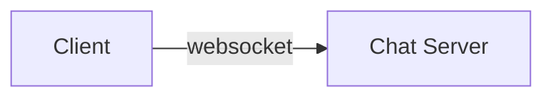

# Chat

Uni4all chat backend implementation.

> **for developers**: write this as you build.
>
> **for outsiders 👀**: take into account that this is still a WiP, and as such, this document represents the actual state of the implementation.

## Current Features

- chat globally
- chat directly to another user
- notifications for user connections and disconnections
- update user username

## Architecture and Choices

For communication with the client, the chat server needs to send messages autonomously. For this polling, long-polling, and websockets are possibilities. Polling and long-polling are more demanding computationally, hence the coice for **websockets**.

## Technologies
- chat server
	- **backend** node.js
	- **websockets** socket.io