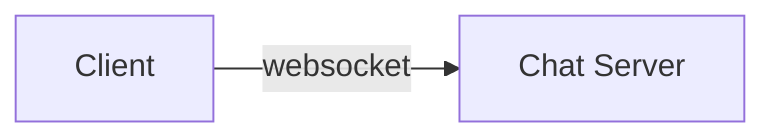

# Chat

Uni4all chat backend implementation.

> **for developers**: write this as you build.
>
> **for outsiders 👀**: take into account that this is still a WiP, and as such, this document represents the actual state of the implementation.

## Current Features

- chat globally
- chat directly to another user
- notifications for user connections and disconnections
- update user username

## API Endpoints
For more detailed documentation, refer to the swagger hub documentation.
### `GET` /chat/location
Gets the URL for the client to connect with.
To be used when the client wants to connect a socket to a chat server.
### `GET` /chat/:group/message
Gets messages for a given group.
This may be useful for when, for example, the user opens a chat group and scrolls up.
- [Information Holder Resource](https://microservice-api-patterns.org/patterns/responsibility/endpointRoles/InformationHolderResource);
- Returns a [Parameter Forest](https://microservice-api-patterns.org/patterns/structure/representationElements/ParameterForest) with information regarding each received message;
- Given the sheer amount of possible messages, includes [Pagination](https://microservice-api-patterns.org/patterns/structure/compositeRepresentations/Pagination):
	- If the page is not requested it returns the first page.
### `GET` /chat/message
Gets all possible messages.
- Really a [Request Bundle](https://microservice-api-patterns.org/patterns/quality/dataTransferParsimony/RequestBundle) that verifies the groups in which the logged client is in, and performs a bunch of `/chat/:group/message` requests;
- Returns a [Parameter Forest](https://microservice-api-patterns.org/patterns/structure/representationElements/ParameterForest) with a list of groups, and a list of messages per group;
- Given the sheer amount of possible messages, includes [Pagination](https://microservice-api-patterns.org/patterns/structure/compositeRepresentations/Pagination):
	- If the page is not requested it returns the first page.

## Mongo Chat Server Endpoints
To access the mongo chat server, use the following URL:
```
http://mongo_chat_server:3000/
```

### Groups

### `GET` /group/
Gets all groups.
- Returns a [Parameter Forest](https://microservice-api-patterns.org/patterns/structure/representationElements/ParameterForest) with a list of groups;
- Pagination is not supported.

### `GET` /group/:id/
Gets a group given a id.
- Needs the id of the group to get.

### `GET` /group/messages
Gets all messages for a given group with pagination.
- Returns a [Parameter Forest](https://microservice-api-patterns.org/patterns/structure/representationElements/ParameterForest) with a list of messages per group;
- Given the sheer amount of possible messages, includes [Pagination](https://microservice-api-patterns.org/patterns/structure/compositeRepresentations/Pagination).
- Receives the following arguments:
  - `groupID`: the group to get the messages for;
  - `page`: the page to get (starts at 0);
  - `perPage`: the amount of messages per page.
```
{
  "groupID": String required,
  "page": Number required,
  "perPage": Number required
}
```

### `GET` /group/user/:up
Gets all groups for a given user.
- Returns a [Parameter Forest](https://microservice-api-patterns.org/patterns/structure/representationElements/ParameterForest) with a list of groups;
- Needs the username of the user to get the groups for.	

### `POST` /group/
Creates a new group.
- Receives the following arguments:
  - `name`: the name of the group;
  - `users`: the users that are part of the group.
```
{
  "name": String required,
  "users": [String] required
}
```

### Messages

### `GET` /message/
Gets all messages with pagination.
- Returns a [Parameter Forest](https://microservice-api-patterns.org/patterns/structure/representationElements/ParameterForest) with a list of messages;
- Given the sheer amount of possible messages, includes [Pagination](https://microservice-api-patterns.org/patterns/structure/compositeRepresentations/Pagination).
- Receives the following arguments:
  - `page`: the page to get (starts at 0);
  - `perPage`: the amount of messages per page.
```
{
  "page": Number required,
  "perPage": Number required
}
```

### `GET` /message/:id
Gets a message given an id.
- Needs the id of the message to get.

### `POST` /message/
Creates a new message.
- Receives the following arguments:
  - `group`: the group the message is for;
  - `from`: the user that sent the message;
  - `message`: the message itself.
```
{
  "group": String required,
  "from": String required,
  "message": String required
}
```

### Users

### `POST` /user/:up
Updates user.
- Needs the username of the user to update.
- Receives the following arguments:
  - `username`: the new username;
  - `name`: the new name;
  - `online`: the new online status.
```
{
  "username": String,
  "name": String,
  "online": Boolean
}
```


## Socket Endpoints

# Chat implementation

- In `/server` expect an implementation of a chat server.
- In `/client` expect an implementation of a frontend that tests and demonstrates the chat features.

There are different kinds of events:
* **connection**:  receives the socket created between the client and the server and happens when the socket is created between client and server;
```json
{
    socket: String
}
```

* **online**: receives the up (identifier of the user) that is getting online and happens when a user goes online in the app;
```json
{
  up: String
}
```
* **disconnect**: receives the up (identifier of the user) that is disconnecting and happens when a user goes offline;
```json
{
  up: String
}
```
*  **chat message**: receives the message to be sent to the chat, the up(identifier) from the user sending, the chat room (identifier) for where it is being sent, and the timestamp when it was sent. This happens whenever a user sends a message to a chat room;
```json
{
  message: String
  up: String,
  room: String,
  timestamp: String
}
```


* **join room**: receives the up(identifier) from the user joining, and the chat room (identifier) it is joining. This happens when a user joins a new chat room.
```json
{
  up: String
}
```

This implementation has event-driven architecture where the client emits events and triggers the communication with the server.


## Architecture and Choices



For communication with the client, the chat server needs to send messages autonomously. For this polling, long-polling, and websockets are possibilities. Polling and long-polling are more demanding computationally, hence the coice for **websockets**.

## Technologies

- chat server
  - **backend** node.js
  - **websockets** socket.io

## Operations

### Non Functional Requirements

#### Fitness Functions

Based on [ISO 25010](https://iso25000.com/index.php/en/iso-25000-standards/iso-25010).

|Name                                                                   |Type       |Quality Attribute|Min Value|Ideal Value|Max Value|Automation                                                                                                                                                                  |
|-----------------------------------------------------------------------|-----------|-----------------|---------|-----------|---------|----------------------------------------------------------------------------------------------------------------------------------------------------------------------------|
|The number of users online per time unit                               |Performance|Capacity         |10 000   |-          |-        |Not on production, connect Y amount of machines                                                                                                                             |
|Latency: Time spent to send a chat message                             |Performance|Time Behaviour   |-        |1sec       |10sec    |Send message to self every X seconds and calculate the time between sending and receiving                                                                                   |
|Channel capacity: The number of messages we are able to send per X time|Performance|Capacity         |1/5sec   |1/1sec     |-        |Send a set of messages in a given rate to self, and calculate the time between sending and receiving, and verify if this time is still in between the acceptable time bounds|
|Respond to unusual number of simultaneous requests (such as DDOS)      |Reliability|Availability     |-        |20 000 000 |-        |Try a DDoS attack every X time                                                                                                                                              |
|Have a relatively high uptime with MTBF / MTRS                         |Reliability|Maturity         |99%      |100%       |-        |Try to connect to the chat server every X seconds, checking if its up or down, calculating MTBF / MTRS                                                                      |
|CVE Analysis, should not use libraries with known vulnerabilities      |Security   |-                |-        |0          |0        |Defect tracking software                                                                                                                                                    |
