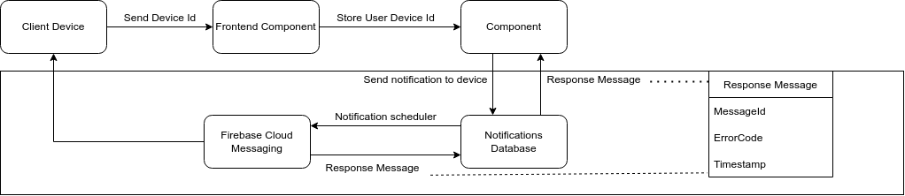
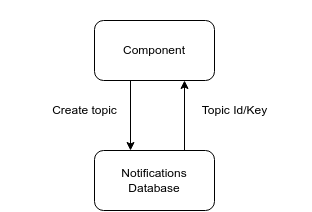

# Notifications

## Endpoints

> For more detailed information about each endpoint please refer to swagger in the notification and notification preferences tags: https://uni4all.servehttp.com/api-docs/ 
### POST `/notification/:user`

With this route you can create a notification for a user.
If the notification is successfully created or the user is ignoring the topic specified the answer status will be "ok". Otherwise the status will be "error" and the error description will be sent along with the answer.

It requires three parameters in the request body:
- topicTokenId 
- title
- content

And another optional parameter, also in the body:
- date (YYYY-MM-DD HH:MM:SS)

If a date is provided, the notification will be scheduled to the specified date.

### GET `/notification/:user/all`
With this route you may obtain all notifications sent to a certain user. 

It requires a parameter in the body:
- userID

### POST `/user/:deviceToken`
This route allows to associate a device token to a userID. This configuration is needed in order to create notifications.

It requires a parameter in the body:
- userID

### POST `/topic/:topic`
This route allows to create a notification topic. Notifications must have topics, which are unique. Upon successful creation, a token specific to that topic will be sent back in the answer in the "token" parameter. Future notifications for that topic must use that token.

### DELETE `/topic/:topic`
This route allows to delete a notification topic.
Besides the topic name in the url, for security measures it also requires the topic token in the body.

As such, it requires 1 parameter in the body:
- identification_token
### GET `/config/all`
This route allows to obtain all existing topic names.  
### GET `/config/blocked/:user`
This route allows to obtain the topics that are being ignored by a certain user.
### POST `/config/:user`
This route is used so that a user can ignore notification topics.

It requires 1 parameter in the body:
- topics - An array of strings that are topic names the user intends on ignoring.

### PATCH `/config/:user`
This route is used so that a user stops ignoring notification topics.

It requires 1 parameter in the body:
- topics - An array of strings that are topic names.

# Design
## Error Report

### Context
Our group agreed it was good practice to log errors generated upon answering request so it was easier to find problems in the code and the system overall. This information is stored properly in the notifications database but should also be able to flow to the clients (whomever uses the API) reliably even though there was a failure in the system. Because this is not a public API, a description of the error might help the developer making use of it to solve the error by correcting his implementation if that is the case.

### Mapping
  

### Consequences

#### Pros
- Error logs allow the both the user and the system's maintainers to understand what the problem is and where it is being generated.
- Error logs can help to faster reach a solution for a certain problem.

#### Cons
- Due to the nature of our component the error logs aren't extremely deatailed so there may be some difficulties 
- Depending on the implementation of the developer the error might reach the user.
- The description of errors might unwantingly reveal implementation details.

## API Key 

### Context
After a topic is created there is the need to identify its creator to prevent others from posting to it. Therefore an implementation of a key is necessary### Maping

### Consequences

#### Pros
- The retrieval of the token can be optimized on the database to allow for fast queries and checks on the permissions of the token
- The implementation of the pattern is of low complexity

#### Cons
- If the token is stolen, it gives its holder total permissions on a topic 
- There is no way to check if the token holder trustworthy
